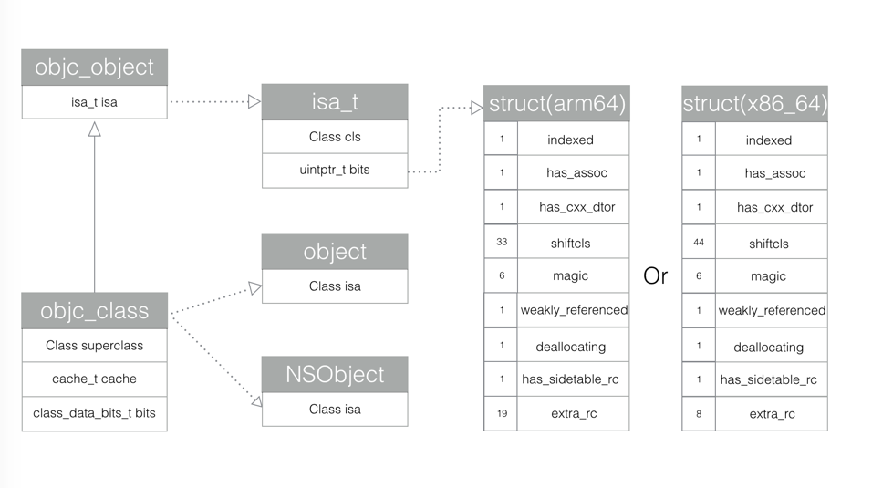

# Objc 2.0

## id和class的数据结构

### id

	struct objc_object {
	private:
	    isa_t isa;
	}
	typedef struct objc_object *id

`id`就是指向`struct objc_object`结构体的指针

### class

	struct objc_class : objc_object {
	    // Class ISA;
	    Class superclass;
	    cache_t cache;             // formerly cache pointer and vtable
	    class_data_bits_t bits;    // class_rw_t * plus custom rr/alloc flags
	}
	typedef struct objc_class *Class

`Class`就是指向`struct objc_class`结构体的指针.

`struct objc_class : objc_object`说明`Class`实质上也是一个对象

### isa_t

	union isa_t 
	{
	    isa_t() { }
	    isa_t(uintptr_t value) : bits(value) { }
	    Class cls;
	    uintptr_t bits;
	}

	# if __arm64__
	#   define ISA_MASK        0x0000000ffffffff8ULL
	#   define ISA_MAGIC_MASK  0x000003f000000001ULL
	#   define ISA_MAGIC_VALUE 0x000001a000000001ULL
	    struct {
	        uintptr_t indexed           : 1;
	        uintptr_t has_assoc         : 1;
	        uintptr_t has_cxx_dtor      : 1;
	        uintptr_t shiftcls          : 33; // MACH_VM_MAX_ADDRESS 0x1000000000
	        uintptr_t magic             : 6;
	        uintptr_t weakly_referenced : 1;
	        uintptr_t deallocating      : 1;
	        uintptr_t has_sidetable_rc  : 1;
	        uintptr_t extra_rc          : 19;
	#       define RC_ONE   (1ULL<<45)
	#       define RC_HALF  (1ULL<<18)
	    };
	
	# elif __x86_64__
	#   define ISA_MASK        0x00007ffffffffff8ULL
	#   define ISA_MAGIC_MASK  0x001f800000000001ULL
	#   define ISA_MAGIC_VALUE 0x001d800000000001ULL
	    struct {
	        uintptr_t indexed           : 1;
	        uintptr_t has_assoc         : 1;
	        uintptr_t has_cxx_dtor      : 1;
	        uintptr_t shiftcls          : 44; // MACH_VM_MAX_ADDRESS 0x7fffffe00000
	        uintptr_t magic             : 6;
	        uintptr_t weakly_referenced : 1;
	        uintptr_t deallocating      : 1;
	        uintptr_t has_sidetable_rc  : 1;
	        uintptr_t extra_rc          : 8;
	#       define RC_ONE   (1ULL<<56)
	#       define RC_HALF  (1ULL<<7)
	    };

### cache_t

	struct cache_t {
	    struct bucket_t *_buckets;
	    mask_t _mask;
	    mask_t _occupied;
	}
	
	typedef unsigned int uint32_t;
	typedef uint32_t mask_t;  // x86_64 & arm64 asm are less efficient with 16-bits
	
	typedef unsigned long  uintptr_t;
	typedef uintptr_t cache_key_t;
	
	struct bucket_t {
	private:
	    cache_key_t _key;
	    IMP _imp;
	}

mask：分配用来缓存bucket的总数。
occupied：表明目前实际占用的缓存bucket的个数。

bucket_t的结构体中存储了一个unsigned long和一个IMP。IMP是一个函数指针，指向了一个方法的具体实现。

cache_t中的`bucket_t *_buckets`其实就是一个散列表，用来存储Method的链表。

Cache的作用主要是为了优化方法调用的性能。当对象receiver调用方法message时，首先根据对象receiver的isa指针查找到它对应的类，然后在类的methodLists中搜索方法，如果没有找到，就使用super_class指针到父类中的methodLists查找，一旦找到就调用方法。如果没有找到，有可能消息转发，也可能忽略它。但这样查找方式效率太低，因为往往一个类大概只有20%的方法经常被调用，占总调用次数的80%。所以使用Cache来缓存经常调用的方法，当调用方法时，优先在Cache查找，如果没有找到，再到methodLists查找。

### class_data_bits_t

	struct class_data_bits_t {
	
	    // Values are the FAST_ flags above.
	    uintptr_t bits;
	}
	
	struct class_rw_t {
	    uint32_t flags;
	    uint32_t version;
	
	    const class_ro_t *ro;
	
	    method_array_t methods;
	    property_array_t properties;
	    protocol_array_t protocols;
	
	    Class firstSubclass;
	    Class nextSiblingClass;
	
	    char *demangledName;
	}
	
	struct class_ro_t {
	    uint32_t flags;
	    uint32_t instanceStart;
	    uint32_t instanceSize;
	#ifdef __LP64__
	    uint32_t reserved;
	#endif
	
	    const uint8_t * ivarLayout;
	
	    const char * name;
	    method_list_t * baseMethodList;
	    protocol_list_t * baseProtocols;
	    const ivar_list_t * ivars;
	
	    const uint8_t * weakIvarLayout;
	    property_list_t *baseProperties;
	
	    method_list_t *baseMethods() const {
	        return baseMethodList;
	    }
	};

