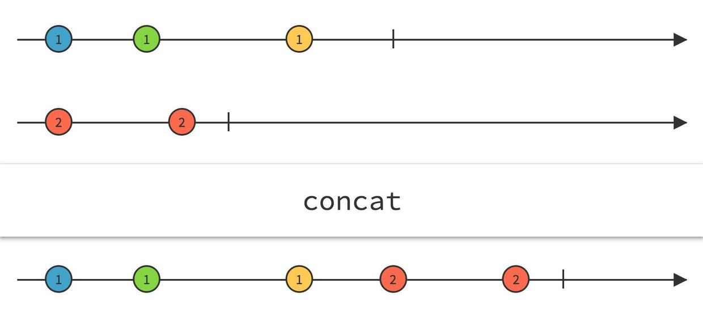
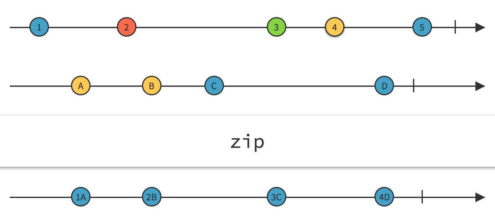

#ReactiveCocoa学习笔记<二> RACSignal 基本操作

本文主要说明

* bind:
* concat:
* zip:

的实现,且明白signal从订阅信号-->发送信号-->接受信号整个过程的原理. 如果不明白可以看[这里](http://www.jianshu.com/p/4fc9482072da).

###bind 的实现

bind函数的作用:

 	/*
	 * -bind: should:
	 * 
	 * 1. Subscribe to the original signal of values.
         订阅原始信号
     
	 * 2. Any time the original signal sends a value, transform it using the binding block.
         一旦原始的信号发送一个value, 都会使用绑定block转换一次
     
	 * 3. If the binding block returns a signal, subscribe to it, and pass all of its values through to the subscriber as they're received.
         如果 binding block 返回一个 signal, 订阅这个信号,并使用subscriber 传递所有接收到的值
     
	 * 4. If the binding block asks the bind to terminate, complete the _original_ signal.
         如果binding block 绑定结束 complete 原始信号
     
	 * 5. When _all_ signals complete, send completed to the subscriber.
         当全部信号完成时, 发送 completed 给 subscriber
	 * 
	 * If any signal sends an error at any point, send that to the subscriber.
	 * 如果中途信号出现了任何error，都要把这个错误发送给subscriber
	 */

在研究bind实现原理之前我们先来写出测试代码:

		//orgsignal
		RACSignal *signal = [RACSignal createSignal:
		                         ^RACDisposable *(id<RACSubscriber> subscriber)
		                         {// block1
		                             [subscriber sendNext:@1];
		                             [subscriber sendNext:@2];
		                             [subscriber sendNext:@3];
		                             [subscriber sendCompleted];
		                             return [RACDisposable disposableWithBlock:^{
		                                 NSLog(@"signal dispose");
		                             }];
		                         }];
	    
	    //bindSignal
	    RACSignal *bindSignal = [signal bind:^RACSignalBindBlock _Nonnull{ //block2
	        
	        return ^RACSignal *(NSNumber *value, BOOL *stop) {// block3
	            value = @(value.integerValue * 2);
	            
	            //innerSignal
	            return [RACSignal return:value];
	        };
	    }];
	    
	    
	    [bindSignal subscribeNext:^(id x) { // block4
	        NSLog(@"subscribe value = %@", x);
	    }];
	    
在整个bind操作过程中由于block可能混乱, 分别对block进行编号  
在这里signal就以上的3个,每个signal 都有一个对应的subscriber. 注意:这三个是指作用相同的, 并不是整个过程就创建3个.  
整个过程会涉及多个block 上面先对遇到的block进行编号, 后面代码中遇到的在分别进行编号.

接着我看来看`-[RACSignal bind:]`的实现

	- (RACSignal *)bind:(RACSignalBindBlock (^)(void))block {
	NSCParameterAssert(block != NULL);

	return [[RACSignal createSignal:^(id<RACSubscriber> subscriber) {
		RACSignalBindBlock bindingBlock = block();

		__block volatile int32_t signalCount = 1;   // indicates self

		RACCompoundDisposable *compoundDisposable = [RACCompoundDisposable compoundDisposable];

		void (^completeSignal)(RACDisposable *) = ^(RACDisposable *finishedDisposable) {
			if (OSAtomicDecrement32Barrier(&signalCount) == 0) {
				[subscriber sendCompleted];
				[compoundDisposable dispose];
			} else {
				[compoundDisposable removeDisposable:finishedDisposable];
			}
		};

		void (^addSignal)(RACSignal *) = ^(RACSignal *signal) {
			OSAtomicIncrement32Barrier(&signalCount);

			RACSerialDisposable *selfDisposable = [[RACSerialDisposable alloc] init];
			[compoundDisposable addDisposable:selfDisposable];

			RACDisposable *disposable = [signal subscribeNext:^(id x) {
				[subscriber sendNext:x];
			} error:^(NSError *error) {
				[compoundDisposable dispose];
				[subscriber sendError:error];
			} completed:^{
				@autoreleasepool {
					completeSignal(selfDisposable);
				}
			}];

			selfDisposable.disposable = disposable;
		};

		@autoreleasepool {
			RACSerialDisposable *selfDisposable = [[RACSerialDisposable alloc] init];
			[compoundDisposable addDisposable:selfDisposable];

			RACDisposable *bindingDisposable = [self subscribeNext:^(id x) {
				// Manually check disposal to handle synchronous errors.
				if (compoundDisposable.disposed) return;

				BOOL stop = NO;
				id signal = bindingBlock(x, &stop);

				@autoreleasepool {
					if (signal != nil) addSignal(signal);
					if (signal == nil || stop) {
						[selfDisposable dispose];
						completeSignal(selfDisposable);
					}
				}
			} error:^(NSError *error) {
				[compoundDisposable dispose];
				[subscriber sendError:error];
			} completed:^{
				@autoreleasepool {
					completeSignal(selfDisposable);
				}
			}];

			selfDisposable.disposable = bindingDisposable;
		}

		return compoundDisposable;
	}] setNameWithFormat:@"[%@] -bind:", self.name];
	}
	
以上就是`-[RACSignal bind:]`实现方法中的全部代码了, 可能看了会是一团乱麻, 没关系, 我们拆开一步一步分析他们.

	return [[RACSignal createSignal:^(id<RACSubscriber> subscriber) { //block5
		...
	}
	
最外层直接返回一个signal,  这个signal就是bindSignal,

对这个block进行标记为block5.  当bindSignal进行被订阅时, 调用block5  

也就是当调用 `[bindSignal subscribeNext:]` 方法时block5被调用.  

接下来看block5中的代码
			
	    // 此时block, bind: 方法的入参 这里调用就是block2
	    // 同时接收了一个binding block 就是block3
		RACSignalBindBlock bindingBlock = block();
       
        // 记录信号的数量
		__block volatile int32_t signalCount = 1;   // indicates self
        
        // 创建 信号阻断 compoundDisposable
		RACCompoundDisposable *compoundDisposable = [RACCompoundDisposable compoundDisposable];
        
        // 先记录两个block,实现下面在分析
        // block6
		void (^completeSignal)(RACDisposable *) = ^(RACDisposable *finishedDisposable) {
			...
		};
        
        // block7
		void (^addSignal)(RACSignal *) = ^(RACSignal *signal) {
           ...
		};

		@autoreleasepool {
          	
			RACSerialDisposable *selfDisposable = [[RACSerialDisposable alloc] init];
			[compoundDisposable addDisposable:selfDisposable];
            
            // 这里订阅 self == orgSignal block1调用
            // 在block1 对 subscriber 发送 消息 然后会调用 block8 相对应的block
			RACDisposable *bindingDisposable = [self subscribeNext:^(id x) { // block8
				// Manually check disposal to handle synchronous errors.
				if (compoundDisposable.disposed) return;
                
				BOOL stop = NO;
                
                // 这里block3被调用, 用户在这个block中完成原始信号值 和 bind信号值得转换
                // stop 变量用来记录用户是否需要停止转换
                // 这里的signal 就是 innerSignal
				id signal = bindingBlock(x, &stop);

				@autoreleasepool {
                    
                    // 调用block7
					if (signal != nil) addSignal(signal);
					if (signal == nil || stop) {
						[selfDisposable dispose];
						completeSignal(selfDisposable);
					}
				}
			} error:^(NSError *error) {
				[compoundDisposable dispose];
				[subscriber sendError:error];
			} completed:^{
				@autoreleasepool {
					completeSignal(selfDisposable);
				}
			}];

			selfDisposable.disposable = bindingDisposable;
		}

		return compoundDisposable;

接下来看block7中的代码:

		void (^addSignal)(RACSignal *) = ^(RACSignal *signal) {
			OSAtomicIncrement32Barrier(&signalCount);

			RACSerialDisposable *selfDisposable = [[RACSerialDisposable alloc] init];
			[compoundDisposable addDisposable:selfDisposable];
			
			// 记录这个block9
			// 订阅innerSignal innerSignal的创建放 是调用`-[RACSignal return:]` 直接调用这个block
			RACDisposable *disposable = [signal subscribeNext:^(id x) { // block 9
				//block4 在这里被调用
				[subscriber sendNext:x];
			} error:^(NSError *error) {
				[compoundDisposable dispose];
				[subscriber sendError:error];
			} completed:^{
				@autoreleasepool {
					completeSignal(selfDisposable);
				}
			}];
			

			selfDisposable.disposable = disposable;
		};
		
整理一下整体过程:

1. 当bindSignal调用 sendNext: 方法时,调用block5. 

2. 在block5中第一句调用 block2, 同时接受了一个RACSignalBindBlock 类型的block3
3. 接着orgin signal 被订阅调用 block1 
4. 在block1中subscriber发送订阅信息,block8被调用
5. 在block8中 调用block3 接受了一个innerSignal, 这个innerSignal 被订阅时,会直接调用sendNext: 和 sendComplete 方法.
6. 接着block7被调用 在block7中订阅innerSignal 这里会立刻调用block9
7. 在block9中会调用block4

以上就是bind的全部工作流程了.

###concat实现

写出测试代码
	
		RACSignal *singal1 = [RACSignal createSignal:^RACDisposable * _Nullable(id<RACSubscriber>  _Nonnull subscriber) {
	        [subscriber sendNext:@1];
	        [subscriber sendCompleted];
	        return [RACDisposable disposableWithBlock:^{
	            
	        }];
	    }];
	    
	    RACSignal *signal2 = [RACSignal createSignal:^RACDisposable * _Nullable(id<RACSubscriber>  _Nonnull subscriber) {
	        [subscriber sendNext:@2];
	        [subscriber sendCompleted];
	        return [RACDisposable disposableWithBlock:^{
	            
	        }];
	    }];
	    
	    RACSignal *concatSignal = [singal1 concat:signal2];
	    
	    [concatSignal subscribeNext:^(id  _Nullable x) {
	        NSLog(@"%@", [x stringValue]);
	    } error:^(NSError * _Nullable error) {
	        
	    } completed:^{
	        NSLog(@"completed");
	    }];

concat作用: 有序的合并两个信号, 注意信号执行的顺序,先执行signal1再执行signal2

接下来从源码层面来看concat 方法的实现:

	- (RACSignal *)concat:(RACSignal *)signal {
	    
	    // 创建一个新的信号, 接受原来两个信号
		return [[RACSignal createSignal:^(id<RACSubscriber> subscriber) {
			RACCompoundDisposable *compoundDisposable = [[RACCompoundDisposable alloc] init];
	        
	        // 接受signal1的信号
			RACDisposable *sourceDisposable = [self subscribeNext:^(id x) {
				[subscriber sendNext:x];
			} error:^(NSError *error) {
				[subscriber sendError:error];
			} completed:^{
	            
	            // 当signal1信号完成时订阅signal2 直接订阅concat的subscriber
				RACDisposable *concattedDisposable = [signal subscribe:subscriber];
				[compoundDisposable addDisposable:concattedDisposable];
			}];
	
			[compoundDisposable addDisposable:sourceDisposable];
			return compoundDisposable;
		}] setNameWithFormat:@"[%@] -concat: %@", self.name, signal];
	}
	
注意:当第一个signal 完成后调用 completed 方法后才会接受 第二个signal发送的信号,否则不会接收第二个信号.

###zip的实现

写出测试代码

		RACSignal *singal1 = [RACSignal createSignal:^RACDisposable * _Nullable(id<RACSubscriber>  _Nonnull subscriber) {
	        [subscriber sendNext:@1];
	        [subscriber sendNext:@3];
	
	        return [RACDisposable disposableWithBlock:^{
	            
	        }];
	    }];
	    
	    RACSignal *signal2 = [RACSignal createSignal:^RACDisposable * _Nullable(id<RACSubscriber>  _Nonnull subscriber) {
	        [subscriber sendNext:@2];
	        [subscriber sendNext:@3];
	        
	        return [RACDisposable disposableWithBlock:^{
	            
	        }];
	    }];
	    
		RACSignal *zipSignal = [singal1 zipWith:signal2];
	    [zipSignal subscribeNext:^(RACTuple *x) {
	        NSLog(@"%@",x);
	    } error:^(NSError * _Nullable error) {
	        
	    } completed:^{
	        NSLog(@"completed");
	    }];

zip的作用:将两个信号压缩成一个元组RACTupe类型, signal1 和 signal2的信号 必须一一对应,否则zip到最少的那个signal. 

源码:

	- (RACSignal *)zipWith:(RACSignal *)signal {
		NSCParameterAssert(signal != nil);
	
		return [[RACSignal createSignal:^(id<RACSubscriber> subscriber) {
			__block BOOL selfCompleted = NO;
			// 存放 signal1 的信号
			NSMutableArray *selfValues = [NSMutableArray array];
	
			__block BOOL otherCompleted = NO;
			// 存放 signal1 的信号
			NSMutableArray *otherValues = [NSMutableArray array];
			
			// 当存放signal value 为0 且 发送completed 信号后,任务这个信号为空,不再有后续的信号
			// 如果两个signal有任意一个为空 则发送完成信号 给 ZipSignal
			void (^sendCompletedIfNecessary)(void) = ^{
				@synchronized (selfValues) {
					BOOL selfEmpty = (selfCompleted && selfValues.count == 0);
					BOOL otherEmpty = (otherCompleted && otherValues.count == 0);
					if (selfEmpty || otherEmpty) [subscriber sendCompleted];
				}
			};
			
			// 存放两个signal的值得数组都不为0是zip为RACTuple
			// 压缩成功移除第一个元素
			void (^sendNext)(void) = ^{
				@synchronized (selfValues) {
					if (selfValues.count == 0) return;
					if (otherValues.count == 0) return;
	
					RACTuple *tuple = RACTuplePack(selfValues[0], otherValues[0]);
					[selfValues removeObjectAtIndex:0];
					[otherValues removeObjectAtIndex:0];
	
					[subscriber sendNext:tuple];
					sendCompletedIfNecessary();
				}
			};
			
			// 订阅signal1
			RACDisposable *selfDisposable = [self subscribeNext:^(id x) {
				@synchronized (selfValues) {
					[selfValues addObject:x ?: RACTupleNil.tupleNil];
					sendNext();
				}
			} error:^(NSError *error) {
				[subscriber sendError:error];
			} completed:^{
				@synchronized (selfValues) {
					selfCompleted = YES;
					sendCompletedIfNecessary();
				}
			}];
			
			// 订阅signal2
			RACDisposable *otherDisposable = [signal subscribeNext:^(id x) {
				@synchronized (selfValues) {
					[otherValues addObject:x ?: RACTupleNil.tupleNil];
					sendNext();
				}
			} error:^(NSError *error) {
				[subscriber sendError:error];
			} completed:^{
				@synchronized (selfValues) {
					otherCompleted = YES;
					sendCompletedIfNecessary();
				}
			}];
	
			return [RACDisposable disposableWithBlock:^{
				[selfDisposable dispose];
				[otherDisposable dispose];
			}];
		}] setNameWithFormat:@"[%@] -zipWith: %@", self.name, signal];
	}
	
当任意一个signal 发送 completed 信号后,将停止压缩,及时后面还有其他信号都会忽略.
