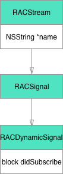
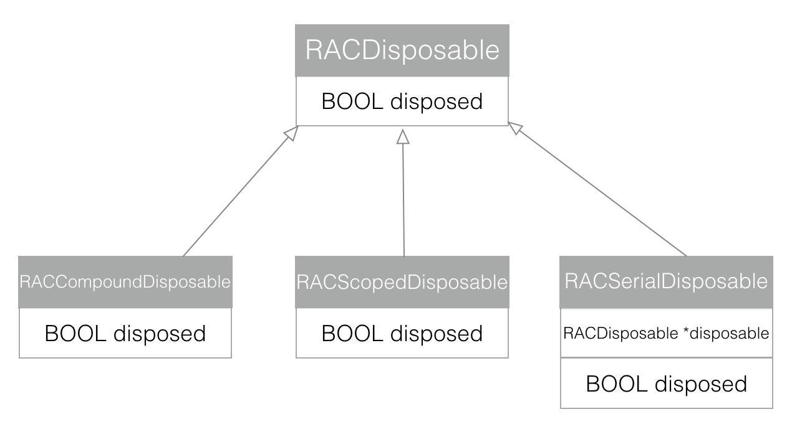

##ReactiveCocoa学习笔记<一> RACSignal 工作原理

ReactiveCocoa 中最核心的概念之一就是信号RACStream。RACStream中有两个子类——RACSignal 和 RACSequence。本文先来分析RACSignal。

学习之前先来一段使用RACSignal的代码

	RACSignal *signal = [RACSignal createSignal:
	                     ^RACDisposable *(id<RACSubscriber> subscriber)
	{
	    [subscriber sendNext:@1];
	    [subscriber sendNext:@2];
	    [subscriber sendNext:@3];
	    [subscriber sendCompleted];
	    return [RACDisposable disposableWithBlock:^{
	        NSLog(@"signal dispose");
	    }];
	}];
	RACDisposable *disposable = [signal subscribeNext:^(id x) {
	    NSLog(@"subscribe value = %@", x);
	} error:^(NSError *error) {
	    NSLog(@"error: %@", error);
	} completed:^{
	    NSLog(@"completed");
	}];
	
	[disposable dispose];

这是RACSignal被订阅的整个过程,我们通过源码来看看整个过程中发生了什么.

	+ (RACSignal *)createSignal:(RACDisposable * (^)(id<RACSubscriber> subscriber))didSubscribe {
		return [RACDynamicSignal createSignal:didSubscribe];
	}
	

   	
RACSignal创建的方法内部是交由RACDynamicSignal来实现的, 同时接收了一个`didSubscribe`block
	
	RACDisposable * (^)(id<RACSubscriber> subscriber)	
这个block的参数是一个遵循`<RACSubscriber>`协议的对象,同时返回一个`RACDisposable`对象.

	@interface RACDynamicSignal ()
	
	// The block to invoke for each subscriber.
	@property (nonatomic, copy, readonly) RACDisposable * (^didSubscribe)(id<RACSubscriber> subscriber);
	
	@end
	
	
	+ (RACSignal *)createSignal:(RACDisposable * (^)(id<RACSubscriber> subscriber))didSubscribe {
		RACDynamicSignal *signal = [[self alloc] init];
		signal->_didSubscribe = [didSubscribe copy];
		return [signal setNameWithFormat:@"+createSignal:"];
	}

RACDynamicSignal这个类非常简单,只是保存了一个`didSubscribe`block, 调用`createSignal:(RACDisposable * (^)(id<RACSubscriber> subscriber))didSubscribe`方法 只是将`didSubscribe`保存, 并给RACSignal设置name

`setNameWithFormat:`是RACStream中实现的方法, RACDynamicSignal是RACStream的子类.

至此,一个基本的RACSignal就被创建完成. 那么`didSubscribe`这个block是在什么被调用的呢?

我们来接来看`subscribeNext:(void (^)(id x))nextBlock`这个方法

	- (RACDisposable *)subscribeNext:(void (^)(id x))nextBlock {
		NSCParameterAssert(nextBlock != NULL);
		
		RACSubscriber *o = [RACSubscriber subscriberWithNext:nextBlock error:NULL completed:NULL];
		return [self subscribe:o];
	}
	
这个方法也非常简单,在内部创建了一个`RACSubscriber`对象, 还记得在创建`RACSignal`中 block的参数`id<RACSubscriber> subscriber`吗? 不过`RACSubscriber *o`这个对象并不是`subscriber`,但是也有一些关系,至于是什么关系继续往下看就知道.

	@interface RACSubscriber ()
	
	// These callbacks should only be accessed while synchronized on self.
	@property (nonatomic, copy) void (^next)(id value);
	@property (nonatomic, copy) void (^error)(NSError *error);
	@property (nonatomic, copy) void (^completed)(void);
	
	@property (nonatomic, strong, readonly) RACCompoundDisposable *disposable;
	
	@end

这个对象内部只保存了4个属性分别是 3个block `next ` `error ` `completed ` 和一个 `RACCompoundDisposable *disposable`(`RACCompoundDisposable `这个东西等下再说), 同时RACSubscriber遵循`<RACSubscriber>协议`

	@protocol RACSubscriber <NSObject>
	@required
	- (void)sendNext:(nullable id)value;
	- (void)sendError:(nullable NSError *)error;
	- (void)sendCompleted;
	- (void)didSubscribeWithDisposable:(RACCompoundDisposable *)disposable;
	@end
	
那么这个对象是怎么被传递给block并被调用的呢,我们接着往下看 `[self subscribe:o]`方法, 这个方法实际上调用的是`-[RACDynamicSignal subscribe:]`方法.

	- (RACDisposable *)subscribe:(id<RACSubscriber>)subscriber {
		NSCParameterAssert(subscriber != nil);
	
		RACCompoundDisposable *disposable = [RACCompoundDisposable compoundDisposable];
		subscriber = [[RACPassthroughSubscriber alloc] initWithSubscriber:subscriber signal:self disposable:disposable];
	
		if (self.didSubscribe != NULL) {
			RACDisposable *schedulingDisposable = [RACScheduler.subscriptionScheduler schedule:^{
				RACDisposable *innerDisposable = self.didSubscribe(subscriber);
				[disposable addDisposable:innerDisposable];
			}];
	
			[disposable addDisposable:schedulingDisposable];
		}
		
		return disposable;
	}

在这个方法中创建一个`RACCompoundDisposable *disposable`对象,并`return disposable `.    
同时创建了`RACPassthroughSubscriber`:同样遵循`<RACSubscriber>`协议, 作用是转发所有事件给另一个`subscriber`.

	- (instancetype)initWithSubscriber:(id<RACSubscriber>)subscriber signal:(RACSignal *)signal disposable:(RACCompoundDisposable *)disposable {
		NSCParameterAssert(subscriber != nil);
	
		self = [super init];
	
		_innerSubscriber = subscriber;
		_signal = signal;
		_disposable = disposable;
	
		[self.innerSubscriber didSubscribeWithDisposable:self.disposable];
		return self;
	}

初始化`RACPassthroughSubscriber`对象过程中,保存了`-[RACDynamicSignal subscribe:]`传来的参数`subscriber` 作为 `_innerSubscriber `

接着往下看 `RACScheduler.subscriptionScheduler`

	+ (RACScheduler *)subscriptionScheduler {
		static dispatch_once_t onceToken;
		static RACScheduler *subscriptionScheduler;
		dispatch_once(&onceToken, ^{
			subscriptionScheduler = [[RACSubscriptionScheduler alloc] init];
		});
	
		return subscriptionScheduler;
	}
	
`RACScheduler `:使用这个类用来在指定的时间和线程(队列)中执行工作.   
`RACScheduler.subscriptionScheduler`返回的是一个单例.在满足下面两个条件时才使用这个方法:

 * `subscription`发生时,存在有效的`+currentScheduler`   
 *  回调block需要立刻被执行    

接着RACScheduler会调用schedule:方法  

	//RACSubscriptionScheduler
	 - (instancetype)init {
			self = [super initWithName:@"org.reactivecocoa.ReactiveObjC.RACScheduler.subscriptionScheduler"];
		
			_backgroundScheduler = [RACScheduler scheduler];
		
			return self;
		}	
	 - (RACDisposable *)schedule:(void (^)(void))block {
			NSCParameterAssert(block != NULL);
		
			if (RACScheduler.currentScheduler == nil) return [self.backgroundScheduler schedule:block];
		
			block();
			return nil;
		}  
---   

	//RACScheduler
	+ (RACScheduler *)currentScheduler {
		RACScheduler *scheduler = NSThread.currentThread.threadDictionary[RACSchedulerCurrentSchedulerKey];
		if (scheduler != nil) return scheduler;
		if ([self.class isOnMainThread]) return RACScheduler.mainThreadScheduler;
	
		return nil;
	}
	+ (RACScheduler *)mainThreadScheduler {
		static dispatch_once_t onceToken;
		static RACScheduler *mainThreadScheduler;
		dispatch_once(&onceToken, ^{
			mainThreadScheduler = [[RACTargetQueueScheduler alloc] initWithName:@"org.reactivecocoa.ReactiveObjC.RACScheduler.mainThreadScheduler" targetQueue:dispatch_get_main_queue()];
		});
		
		return mainThreadScheduler;
	}

如果`RACScheduler.currentScheduler != nil` 直接调用block回调, 否则调用`[self.backgroundScheduler schedule:block]`方法. 

所以`schedule:(void (^)(void))block`的入参block会被立刻执行.

	RACDisposable *innerDisposable = self.didSubscribe(subscriber);
	[disposable addDisposable:innerDisposable];

这是在block中执行的操作,在这里第一个方法  
`createSignal:
                     ^RACDisposable *(id<RACSubscriber> subscriber`  
                     传入的block被调用同时将`RACPassthroughSubscriber *subscriber`对象作为block的参数传递了出去.
                     

	[subscriber sendNext:@1];
                        

这是在block中执行的操作, 实际上调用的   

	- (void)sendNext:(id)value {
		if (self.disposable.disposed) return;
	
		if (RACSIGNAL_NEXT_ENABLED()) {
			RACSIGNAL_NEXT(cleanedSignalDescription(self.signal), cleanedDTraceString(self.innerSubscriber.description), cleanedDTraceString([value description]));
		}
	
		[self.innerSubscriber sendNext:value];
	}	
	
`-[RACPassthroughSubscriber sendNext:]`,这个方法中有调用了`[self.innerSubscriber sendNext:value]` 

	- (void)sendNext:(id)value {
		@synchronized (self) {
			void (^nextBlock)(id) = [self.next copy];
			if (nextBlock == nil) return;
	
			nextBlock(value);
		}
	}     
	
这是-[RACSubscriber sendNext:]方法的实现,在这里调用了  
`RACDisposable *disposable = [signal subscribeNext:^(id x){};`  
传入的block.同时这个block的调用时线程安全的

到这里一个完整的signal响应事件, 从订阅到响应算是完整了.

回过头来重新整理一下整个RACSignal的整个流程

1. 创建RACSignal对象,在RACDynamicSignal中保存didSubscribe
2. 订阅RACSignal,创建RACSubscriber 保存sendNext, sendError, sendComplete block
3. 调用-[RACDynamicSignal subscribe:] 以第二步创建的RACSubscriber对象作为_innerSubscriber创建RACPassthroughSubscriber, 创建RACScheduler.subscriptionScheduler 在schedule:回调block中 执行在第一步中保存的didSubscribe block
4. didSubscribe block的参数 subscriber 调用sendNext:等方法 执行第二步中保存的相应的block.

##RACDisposable

在整个过程有很多RACDisposable存在,接下来我们来讨论一下RACDisposable这个类的作用.

RACDisposable有三个子类: 

###RACDisposable:
主要是用来阻断信号的作用.   
主要方法有两个分别是:

	- (BOOL)isDisposed {
		
		return _disposeBlock == NULL;
	}
_disposeBlock是一个指针指向这个对象本身或者指向block, 最终这个指针指向哪个有初始化的方法决定

	- (instancetype)init {
		self = [super init];
	
		_disposeBlock = (__bridge void *)self;
		OSMemoryBarrier();
	
		return self;
	}
	
	- (instancetype)initWithBlock:(void (^)(void))block {
		NSCParameterAssert(block != nil);
	
		self = [super init];
	
		_disposeBlock = (void *)CFBridgingRetain([block copy]); 
		OSMemoryBarrier();
	
		return self;
	}
	
如果使用`-init`方法初始化指向对象本身, 如果使用`-initWithBlock:`方法初始化则指向block

第二个方法是

	- (void)dispose {
		void (^disposeBlock)(void) = NULL;
	
		while (YES) {
			void *blockPtr = _disposeBlock;
			if (OSAtomicCompareAndSwapPtrBarrier(blockPtr, NULL, &_disposeBlock)) {
				if (blockPtr != (__bridge void *)self) {
					disposeBlock = CFBridgingRelease(blockPtr);
				}
	
				break;
			}
		}
	
		if (disposeBlock != nil) disposeBlock();
	}
调用`-dispose `如果指针指向block则调用block并且是指针指向NULL,否则直接指向NULL.

工作流程:当调用 `- dispose`方法后_disposeBlock == NULL 在`-isDisposed` 返回结果为YES说明信号被阻断.

在上面`[RACPassthroughSubscriber sendNext:]`方法中首先会判断`[self.disposealbe isDisposed]`如果为YES则直接return,达到阻断信号的作用.

###RACCompoundDisposable:   
可以管理多个RACDisposable或他的子类,他内部持有一个数组`_disposables`存放了多个RACDisposable,调用`-[RACCompoundDisposable dispose]`是对`_disposables`中的每一个对象调用`dispose`方法.(dispose是RACDisposable的方法,所以他的子类都有这个方法,只是实现的方式不同)

在RACCompoundDisposable内部管理了两个数组

	//一个简单的宏 
	#define RACCompoundDisposableInlineCount 2 
	//两个元素 的数组 优先使用
	RACDisposable *_inlineDisposables[RACCompoundDisposableInlineCount]
	//如果_disposables > _inlineDisposables 数量使用_disposables
	CFMutableArrayRef _disposables;

	- (void)dispose {
		#if RACCompoundDisposableInlineCount
		RACDisposable *inlineCopy[RACCompoundDisposableInlineCount];
		#endif
	
		CFArrayRef remainingDisposables = NULL;
		
		// 加锁
		pthread_mutex_lock(&_mutex);
		{	
			// 信号被阻断
			_disposed = YES;
	
			#if RACCompoundDisposableInlineCount
			for (unsigned i = 0; i < RACCompoundDisposableInlineCount; i++) {
				inlineCopy[i] = _inlineDisposables[i];
				_inlineDisposables[i] = nil;
			}
			#endif
	
			remainingDisposables = _disposables;
			_disposables = NULL;
		}
		pthread_mutex_unlock(&_mutex);
	
		#if RACCompoundDisposableInlineCount
		// Dispose outside of the lock in case the compound disposable is used
		// recursively.
		for (unsigned i = 0; i < RACCompoundDisposableInlineCount; i++) {
			[inlineCopy[i] dispose];
		}
		#endif
	
		if (remainingDisposables == NULL) return;
	
		CFIndex count = CFArrayGetCount(remainingDisposables);
		CFArrayApplyFunction(remainingDisposables, CFRangeMake(0, count), &disposeEach, NULL);
		CFRelease(remainingDisposables);
	}

在这个方法里面依次对管理的数组中的disposeable对象执行-dispose方法, 同时修改`_disposed = YES`

	- (BOOL)isDisposed {
		pthread_mutex_lock(&_mutex);
		BOOL disposed = _disposed;
		pthread_mutex_unlock(&_mutex);
	
		return disposed;
	}

###RACScopedDisposable
	+ (instancetype)scopedDisposableWithDisposable:(RACDisposable *)disposable {
		return [self disposableWithBlock:^{
			[disposable dispose];
		}];
	}
	
	- (void)dealloc {
		[self dispose];
	}
	
	- (RACScopedDisposable *)asScopedDisposable {
		// totally already are
		return self;
	}
	
在这个类中实现了这三个方法在 在`-dealloc`方法中调用他自己的-dispose方法,同时在初始化中执行block 执行初始化方法入参的`[disposable dispose]`方法

###RACSerialDisposable

内部持有一个RACDisposable,同时可以和外部交换RACDisposable

	- (RACDisposable *)swapInDisposable:(RACDisposable *)newDisposable {
		RACDisposable *existingDisposable;
		BOOL alreadyDisposed;
	
		pthread_mutex_lock(&_mutex);
		alreadyDisposed = _disposed;
		if (!alreadyDisposed) {
			existingDisposable = _disposable;
			_disposable = newDisposable;
		}
		pthread_mutex_unlock(&_mutex);
	
		if (alreadyDisposed) {
			[newDisposable dispose];
			return nil;
		}
	
		return existingDisposable;
	}
	
上面是swap方法实现, 首先声明一个`BOOL alreadyDisposed`记录此对象是`_disposed` 交换 newDisposable 和 _disposable 如果`alreadyDisposed == YES` 执行`[newDisposable dispose];` return nil; 否则 返回 原来的_disposable
