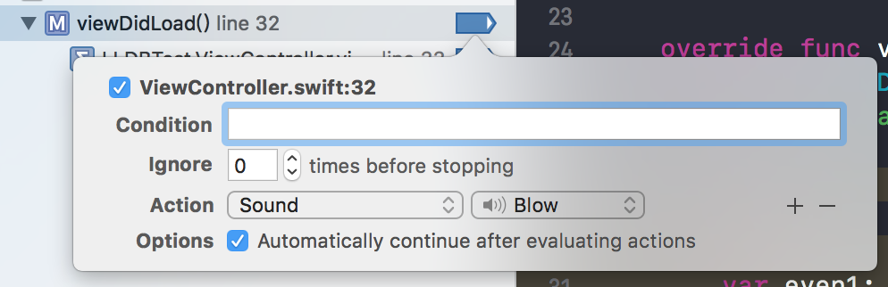

# LLDB学习总结

> LLDB 是一个有着 REPL 的特性和 C++ ,Python 插件的开源调试器。LLDB 绑定在 Xcode 内部，存在于主窗口底部的控制台中。调试器允许你在程序运行的特定时暂停它，你可以查看变量的值，执行自定的指令，并且按照你所认为合适的步骤来操作程序的进展

## 设置断点

在代码框左侧可以设置断点，当程序执行到断点所在的位置是，程序会停止，这个时候我们可以对程序进行调试。

## help

在调试框内我们输入help命令，可以查看可以使用的命令及其简单的描述。

如果希望看到某个命令的用法，可以在调试器内输入`help 命令`以`brankpoint`为例。

学会使用help命令，可以给我们在调试的过程中提供很多帮助。

## expression

LLDB的命令遵循唯一匹配原则：假如根据前n个字母已经能唯一匹配到某个命令，则只写前n个字母等效于写下完整的命令。`expression`和`e`表示相同的命令。

如果希望修改某个值，可以使用`expression`或`e`执行语句。在程序运行的中，如果使用`e`命令改变了某个变量的值，那么在实际运行过程中这个变量也会被修改。（仅在OC中有效，在swift中修改变量的值只在调试期间生效，当继续运行程序时，变量的值实际还是原来的值。）

使用`e`声明变量时，使用`$`符号开始作为变量的第一个字符。

在`expression`命令的说有有这样一句话

> Important Note: Because this command takes 'raw' input, if you use any
     command options you must use ' -- ' between the end of the command options
     and the beginning of the raw input.

在使用这个命令的时候需要使用` -- `将实际 command options 和 实际的表达式分开以免造成歧义。

## print & po

### p

平时使用中这是我们使用最多的两个命令.

`print`可是使用`p`代替，实际上它只是` expression -- ` 的别名。

	(lldb) e -- self.view
	(UIView?) $R0 = 0x00007fa1e2407000 {
	  UIKit.UIResponder = {
	    ObjectiveC.NSObject = {}
	  }
	}
	(lldb) p self.view
	(UIView?) $R1 = 0x00007fa1e2407000 {
	  UIKit.UIResponder = {
	    ObjectiveC.NSObject = {}
	  }
	}

上面两个代码效果完全相同。

**在swift中如果使用` let `声明一个变量，使用lldb不能打印这个变量，如果你试图打印这个变量，将会得到下面的提示，因为编译器认为你不会再改变这个变量，所以即使修改optimization level 为 NONE也不能打印，如果你希望打印这个变量可以将这个变量用` var `声明。**

	error: <EXPR>:3:1: error: use of unresolved identifier 'even1'
	even1
	^~~~~

### po

在OC和swift中所有的对象都是用指针代表的（除了某些特殊的对象，这里不做讨论），使用`p`打印出来的都是对象的指针，而不是对象的本身，如果我们想要打印对象，可以使用` po `（它实际上是`expression -O --`的别名）。`po`打印的内容在OC和swift中是有区别的。

在OC中这样打印出来的是当前对象的`description`方法的返回值，如果没有实现回到父类中寻找，知道找到NSObject中，但是`-[NSObject description]`返回实际上也是对象的指针，和使用`p`并没有区别，所有对自定义的类，我们可以实现`description `方法来方便我们调试。

在swift中,对遵守`CustomDebugStringConvertible`协议的类或结构体，使用` po `可以自定义打印内容。

## 流程控制

当程序到达断点的时候程序就会暂停，在调试条上面会出现4个可以控制流程的按钮

1. continue 按钮，继续执行直到下一个断点，在LLDB中使用`process continue`,`continue`,`c`都能有相同的作用。
2. step over 按钮， 会以黑盒的方式执行一行代码。如果所在这行代码是一个函数调用，那么就不会跳进这个函数，而是会执行这个函数，然后继续。LLDB 则可以使用 `thread step-over`，`next`，或者 `n` 命令。
3. step in 按钮， 如果当前行是函数，则会进入函数内部，如果不是，则和step over作用相同，LLDB 则可以使用 `thread step in`，`step`，或者 `s` 命令。
4. step out 按钮，如果你曾经不小心跳进一个函数，但实际上你想跳过它，常见的反应是重复的运行 n 直到函数返回。其实这种情况，step out 按钮是你的救世主。它会继续执行到下一个返回语句 (直到一个堆栈帧结束) 然后再次停止。

### Thread Return

调试时，还有一个很棒的函数可以用来控制程序流程：thread return 。它有一个可选参数，在执行时它会把可选参数加载进返回寄存器里，然后立刻执行返回命令，跳出当前栈帧。这意味这函数剩余的部分不会被执行。这会给 ARC 的引用计数造成一些问题，或者会使函数内的清理部分失效。但是在函数的开头执行这个命令，是个非常好的隔离这个函数，伪造返回值的方式 。

## 创建断点

断点是一个非常强大的功能，在XCcode左侧有一个管理断点的面板，在这里可以看到所有的断点，并且可以管理，编辑和为断点添加行为。

### 编辑断点

选中断点右键点击断点，出现下面断点

#### 1. condition:指定当满足条件时断点才会生效

来看一个例子，在Condition中设置一个 `i == 5`

代码如下

	override func viewDidLoad() {
        super.viewDidLoad()
        var i = 5
        // 在这里设置断点 
    }

这个时候代码执行到这里时会暂停，如果修改代码`var i = 6`则断点不会停下。

#### 2. Ignore:忽略前N次

上面断点设置Ignore为3，在控制台中会打印

	0
	1
	2
	(lldb) 

然后程序暂停。

#### 3.Action

上面的例子中，你或许想知道每一次到达断点的时候 i 的值。我们可以使用 p i 作为断点行为。这样每次到达断点的时候，都会自动运行这个命令。

#### 4.赋值后继续运行

看编辑断点弹出窗口的底部，你还会看到一个选项： "Automatically continue after evaluation actions." 。它仅仅是一个选择框，但是却很强大。选中它，调试器会运行你所有的命令，然后继续运行。看起来就像没有执行任何断点一样 (除非断点太多，运行需要一段时间，拖慢了你的程序)。

## watchpoit

使用lldb也可以实现变量的监听。当我们关心某个类实例变量何时被修改，如果使用属性修改实例变量的值时，我们可以在setter方法中打断点或者直接在属性上面打上断点，都能够监听变量改变，但是有时候直接通过修改实例变量修改，不会调用setter方法。

那么如何监听这个实例变量被改变了呢，我们可以通过监视这个实例变量的地址的写入。

下面示例代码：

	class Person {
	    
	    var name: String!
	    
	}

如果希望监听`Person`实例变量`name`的改变

		let person = Person()
        // 在这里打上断点
        person.name = "john"
        
        person.name = "toms"

控制台

	(lldb) watchpoint set variable -s 8 -- person.name
	Watchpoint created: Watchpoint 1: addr = 0x6000004468b0 size = 8 state = enabled type = w
	    declare @ '/Users/blade/Desktop/LLDBTest/LLDBTest/ViewController.swift:26'
	    watchpoint spec = 'person.name'
	    new value: ""

当`person.name`的值被修改的时候会程序会暂停，但是我在试验的遇到一个问题，第一次修改的时候new value总是空的，我也不知道是为什么。

	// 监听属性修改时，控制台打印
	Watchpoint 1 hit:
	old value: ""
	new value: ""
	
	Watchpoint 1 hit:
	old value: ""
	new value: "toms"

注意在OC中需要通过`watchpoint set variable -s 8 -- person->_name`这种方式去监听变量的变化。

## 总结

lldb是非常强大的，如果掌握的这些方法，能够极大提高解决bug的效率。

##引用

> [lldb error: variable not available](https://stackoverflow.com/questions/13040777/lldb-error-variable-not-available)

> [与调试器共舞 - LLDB 的华尔兹](https://objccn.io/issue-19-2/)

